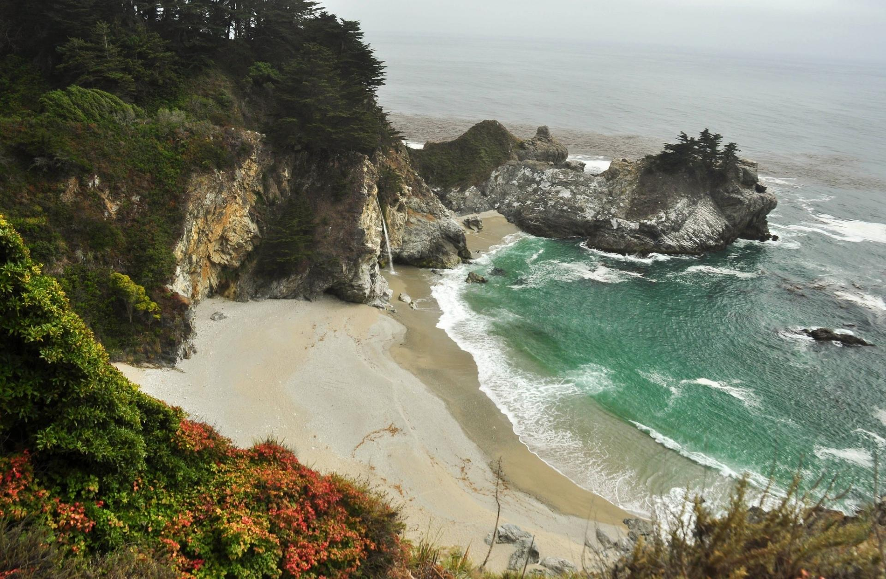
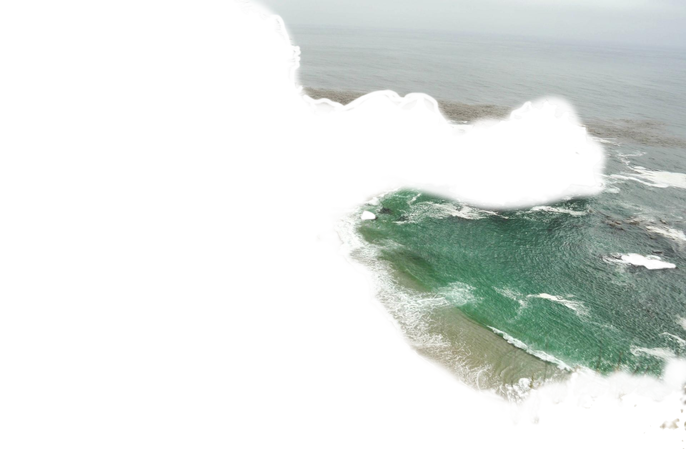

# CSS & HTML Realistic water effect
> Pretty damn cool


### [URL demo](https://goldenmaximo.github.io/CSS-Realistic-Water/)

#### You can change the strenght of the animation by using the zoom on your browser (CTRL + SCROLL on Chrome)

<br>

<hr>

First I selected an image which had this kind of water surrounded by rock vibe which was easier to make the effect seem more realistic with:



Then I cropped out the water using [GIMP](https://www.gimp.org/):



Then I used the image as the entire page background and overlayed the cropped water on top of it:

*HTML:*

```
<div class="background">
    <div class="water"></div>
</div>
```

*CSS:*

```
.background {
    position: absolute;
    top: 0;
    bottom: 0;
    left: 0vw;
    width: 101vw;
    height: 100vh;
    background-image: url(seashore.jpg);
    background-size: cover;
}

.background .water {
    position: absolute;
    top: 0;
    bottom: 0;
    left: 0vw;
    width: 100%;
    height: 100%;
    background-image: url(transparent-seashore.png);
    background-size: cover;
}
```

Then I applied the SVG turbulence filter to the water:

*HTML:*

```
<svg>
    <filter id="turbulence" x="0" y="0" width="100%" height="100%">
        <feTurbulence id="sea-filter" numOctaves="3" seed="2" baseFrequency="0.02 0.05"></feTurbulence>
        <feDisplacementMap scale="20" in="SourceGraphic"></feDisplacementMap>
        <animate xlink:href="#sea-filter" attributeName="baseFrequency" dur="60s" keyTimes="0;0.5;1" values="0.02 0.06;0.04 0.08;0.02 0.06" repeatCount="indefinite"></animate>
    </filter>
</svg>
```

*CSS:*

```
.background .water {
    filter: url("#turbulence");
}
```

Resulting in this mind-tripping effect. Super simple and super cool.

Here's a video tutorial on how to do it:

[](https://www.youtube.com/watch?v=q-i0rZBZvBk)
